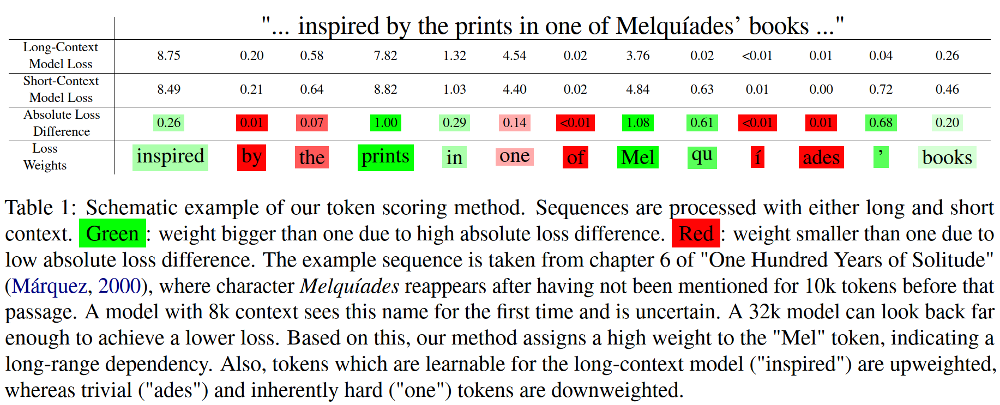

<p  align="center">
  
</p>

# Token Weighting for Long-Range Language Modeling
[](https://put-here-your-paper.com)
[](https://opensource.org/licenses/Apache-2.0)
[](https://www.python.org/)
## Overview
This repository provides the code for our paper "Token Weighting for Long-Range Language Modeling", accepted to NAACL 2025 Findings.
It contains code to preprocess [PG19](https://huggingface.co/datasets/deepmind/pg19) (i.e. split, tokenize, score and save documents) in `data_preprocessing.py`. `training.py` 
implements a training loop with the settings from the `config` folder using a custom
huggingface trainer. The novelty of `trainer.py` lies in the implementation of the flexible
`ShortLongLoss`, which can model all the losses invstigated in our paper (see [Loss Variants Table](#loss-variants-table) below).
## Getting Started
To get started, clone the repo and run 

```
pip install -r requirements.txt
```
Additionally, make sure that `CUDA 11.7.` and `torch` are installed before installing flash attention
```
pip install flash_attn==2.7.3
```
## Preprocess Data
> Note: all entrypoint scripts presented in the following contain
> a --help flag for a detailed breakdown of their CLI arguments

If you want to preprocess the data (i.e. chunk into 32k sequences and save in tokenized form), run

```
python preprocess_data.py
```

### Calculate frozen base data
For the frozen variant, the sequences first have to be scored and saved: 

```
python main.py --run_name llama3_32k_dense_precompute_weights --launcher 'accelerate launch'
```

## Run Training
If you want to log your training runs with [aim](https://aimstack.readthedocs.io/en/latest/overview.html), run 

```
aim init
```

Then you can start the self-scoring training (i.e. the unfrozen variant) via

```
python main.py --out_path /directory/for/saved/runs
```

## Loss variants
The loss variants are determined by the config file. First, `use_frozen_base` indicates
whether self-scoring (unfrozen) is used or not (frozen). The `base_length` determines the
length of the short-context model. `base_stride` is the stride used for scoring the long document
with the short-context model. The overlap between subsequences is `base_length - base_stride`. Increasing
the stride makes the method more efficient (less forward passes) but more inexact. Usually, you want to use the
smallest `base_stride` that leads to `chunk_size/base_length` additional forward passes. This value
can be calculated via `(1-base_length/chunk_size)*base_length`, e.g. 6144 for 32768 context.
The basic `logit_comparison` in the loss is 

$$\text{LongLoss} - \text{ShortLoss} = -\log(p^l) - (-\log(p^s)) = \log\left(\frac{p^s}{p^l}\right)$$

The `transforms` are applied sequentially to it. Note that the `minus` transform leads to reversed nominator and denominator in the logarithm.
The `truncation` $\gamma$ clips the values higher than itself. The sparsification parameter $\kappa$ only considers the top $\kappa$ percent of the tokens.
`interpolation` $\lambda$ applies a convex combination with the vanilla loss. Note that $\kappa=1$ or $\lambda=1$ lead to standard cross-entropy loss.
`normalization` normalizes the weights such that they average to 1.

## Loss Variants Table
Losses investigated in the paper can be realised as follows:

| Loss Variant                                                  | Transforms            | Interpolation | Normalization | Sparsification | Truncation | 
|---------------------------------------------------------------|-----------------------|---------------|---------------|----------------|------------|
| Dense $\lambda$                                               | [absolute]            | $\lambda$     | L1            | -              | -          |
| Sparse $\kappa$                                               | [absolute]            | -             | L1            | $\kappa$       | -          | 
| [LongCE](https://openreview.net/forum?id=fL4qWkSmtM) $\gamma$ | [minus, exp]          | -             | -             | -              | $\gamma$   | 
| PPMI s                                                        | [minus, shift s, max] | -             | L1            | $\kappa$       | -          | 
| NPMI s                                                        | [shift s, max]        | -             | L1            | $\kappa$       | -          | 

## Contact

Contact person:

Falko Helm: [📧 Email](mailto:falko.helm@tu-darmstadt.de) | [💻 GitHub](https://github.com/falko1)

If you have any questions, please do not hesitate to contact us or (preferably) open an issue here on GitHub.

https://www.ukp.tu-darmstadt.de/   
UKP Lab is part of the TU Darmstadt: https://www.tu-darmstadt.de/

```
This repository contains experimental software and is published for the sole purpose of giving additional background details on the respective publication.
```